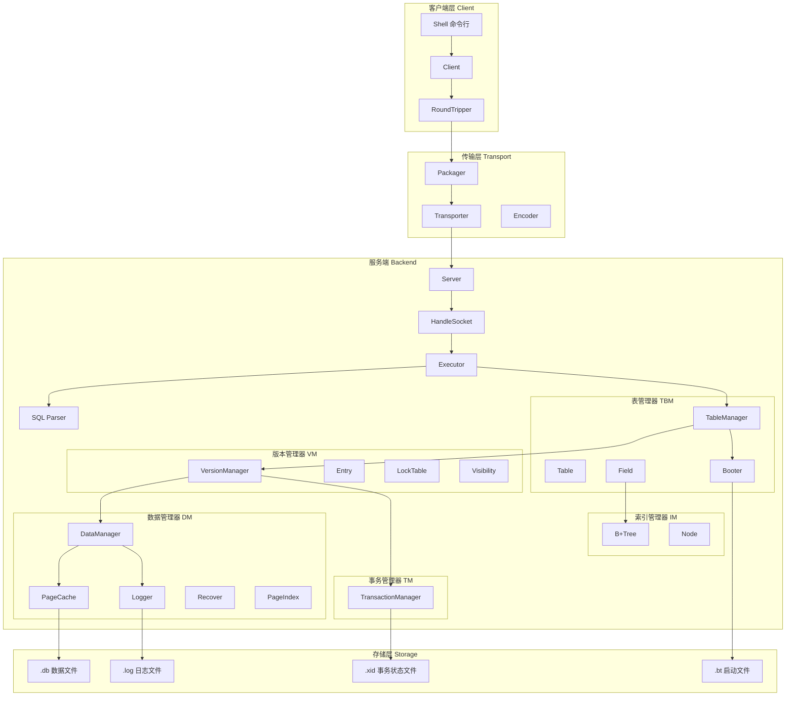
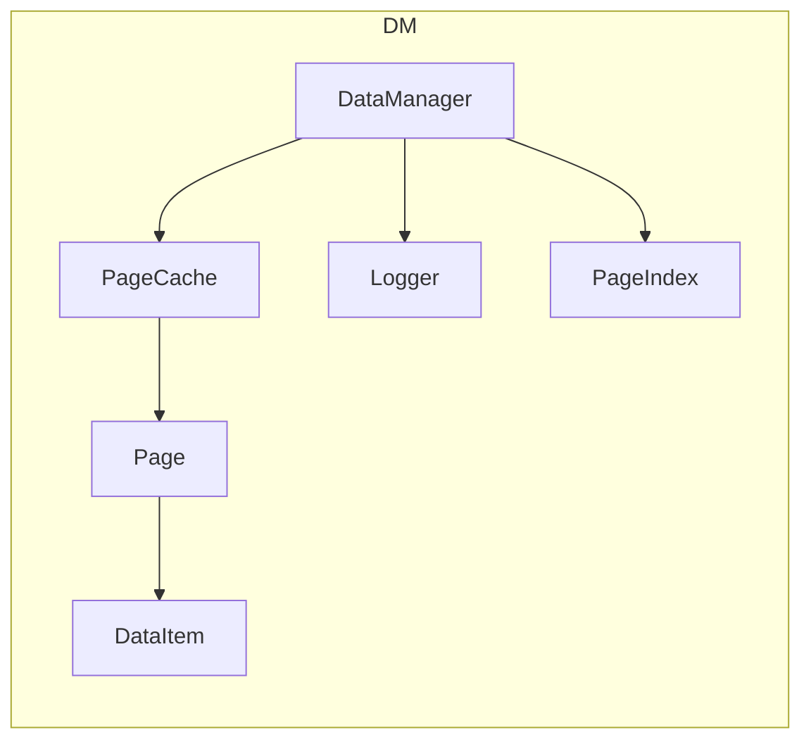
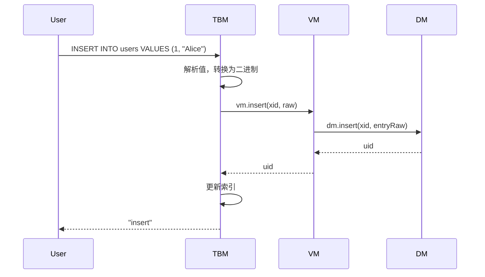
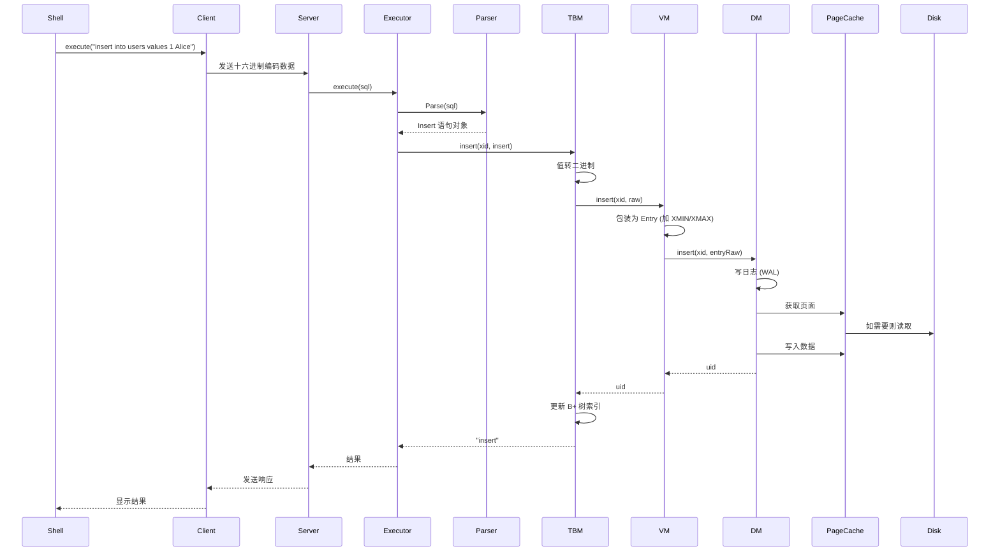

# JTxBase 项目详细讲解

JTxBase 是一个**从零实现的简易关系型数据库系统**，使用 Java 编写。它实现了数据库的核心功能：事务管理、数据存储、版本控制、索引、SQL 解析和客户端-服务器通信。

---

## 📐 整体架构



---

## 📁 项目结构

```
JTxBase/
├── src/main/java/
│   ├── backend/                    # 服务端核心
│   │   ├── Launcher.java          # 服务端启动入口
│   │   ├── tm/                    # 事务管理器 (Transaction Manager)
│   │   ├── dm/                    # 数据管理器 (Data Manager)
│   │   ├── vm/                    # 版本管理器 (Version Manager)
│   │   ├── tbm/                   # 表管理器 (Table Manager)
│   │   ├── im/                    # 索引管理器 (Index Manager)
│   │   ├── parser/                # SQL 解析器
│   │   ├── server/                # 服务器网络层
│   │   ├── common/                # 通用组件 (缓存等)
│   │   └── utils/                 # 工具类
│   ├── client/                    # 客户端
│   └── transport/                 # 网络传输层
└── testDB.*                       # 测试数据库文件
```

---

## 🏗️ 分层设计详解

整个系统采用**分层架构**，从下往上依次是：

### 1️⃣ 事务管理器 TM (Transaction Manager)

**位置**: [backend/tm](file:///d:/111-WORK/JTxBase/src/main/java/backend/tm)

**职责**: 管理事务的生命周期，维护事务状态（活跃/已提交/已回滚）

**核心文件**:

- [TransactionManager.java](file:///d:/111-WORK/JTxBase/src/main/java/backend/tm/TransactionManager.java) - 接口定义
- [TransactionManagerImpl.java](file:///d:/111-WORK/JTxBase/src/main/java/backend/tm/TransactionManagerImpl.java) - 实现

**存储格式** (`.xid` 文件):

```
[8字节 XID计数器] [1字节 事务1状态] [1字节 事务2状态] ...
```

**事务状态**:

- `0` - Active (活跃)
- `1` - Committed (已提交)
- `2` - Aborted (已回滚)

**关键设计**:

```java
// 超级事务 XID=0，永远为已提交状态
public static final long SUPER_XID = 0;

// 开启新事务
public long begin() {
    counterLock.lock();
    try {
        long xid = xidCounter + 1;
        updateXID(xid, FIELD_TRAN_ACTIVE);  // 写入磁盘
        incrXIDCounter();                    // 更新计数器
        return xid;
    } finally {
        counterLock.unlock();
    }
}
```

> [!IMPORTANT]
> TM 是最底层的模块，不依赖任何其他模块。所有状态变更都**立即写入磁盘**（通过 `fc.force(false)`），保证崩溃恢复时事务状态可靠。

---

### 2️⃣ 数据管理器 DM (Data Manager)

**位置**: [backend/dm](file:///d:/111-WORK/JTxBase/src/main/java/backend/dm)

**职责**: 管理数据的物理存储，包括页面管理、缓存、日志和崩溃恢复

**核心组件**:



#### 2.1 页面 (Page)

**文件**: [backend/dm/page](file:///d:/111-WORK/JTxBase/src/main/java/backend/dm/page)

页面是数据存储的基本单位，大小为 **8KB**。

- **Page1** - 第一页特殊页，用于启动检查（检测上次是否正常关闭）
- **PageX** - 普通数据页

**普通页结构**:

```
[2字节 FSO (Free Space Offset)] [数据1] [数据2] ...
```

FSO 指向空闲空间的起始位置，插入数据时：

1. 读取 FSO 确定写入位置
2. 写入数据
3. 更新 FSO

#### 2.2 数据项 (DataItem)

**文件**: [backend/dm/dataItem](file:///d:/111-WORK/JTxBase/src/main/java/backend/dm/dataItem)

DataItem 是 DM 对外提供的数据抽象，结构为：

```
[1字节 ValidFlag] [2字节 DataSize] [Data...]
```

- `ValidFlag = 0` 表示数据有效
- `ValidFlag = 1` 表示数据无效（已删除）

#### 2.3 页面缓存 (PageCache)

**文件**: [backend/dm/pageCache](file:///d:/111-WORK/JTxBase/src/main/java/backend/dm/pageCache)

使用**引用计数**策略管理页面缓存，核心逻辑在 [AbstractCache.java](file:///d:/111-WORK/JTxBase/src/main/java/backend/common/AbstractCache.java)：

```java
protected T get(long key) throws Exception {
    while (true) {
        lock.lock();
        // 1. 检查是否有其他线程正在获取
        if (getting.containsKey(key)) { /* 等待 */ }
        // 2. 检查缓存中是否存在
        if (cache.containsKey(key)) {
            references.put(key, references.get(key) + 1);  // 增加引用
            return obj;
        }
        // 3. 不存在则从磁盘加载
        getting.put(key, true);
        lock.unlock();
        break;
    }
    T obj = getForCache(key);  // 从磁盘读取
    cache.put(key, obj);
    references.put(key, 1);
    return obj;
}
```

#### 2.4 日志与恢复 (Logger & Recover)

**文件**:

- [backend/dm/logger](file:///d:/111-WORK/JTxBase/src/main/java/backend/dm/logger)
- [Recover.java](file:///d:/111-WORK/JTxBase/src/main/java/backend/dm/Recover.java)

实现 **WAL (Write-Ahead Logging)** 策略：

**日志格式**:

- **Insert Log**: `[LogType=0] [XID] [Pgno] [Offset] [Raw]`
- **Update Log**: `[LogType=1] [XID] [UID] [OldRaw] [NewRaw]`

**恢复流程**:

```java
public static void recover(TransactionManager tm, Logger lg, PageCache pc) {
    // 1. 扫描日志确定最大页号，截断多余页面
    pc.truncateByBgno(maxPgno);
    // 2. Redo: 重做所有已提交事务
    redoTranscations(tm, lg, pc);
    // 3. Undo: 回滚所有未完成事务
    undoTranscations(tm, lg, pc);
}
```

> [!NOTE]
> 恢复时 Redo 按日志顺序执行，Undo 按**逆序**执行。这保证了即使崩溃也能恢复到一致状态。

---

### 3️⃣ 版本管理器 VM (Version Manager)

**位置**: [backend/vm](file:///d:/111-WORK/JTxBase/src/main/java/backend/vm)

**职责**: 实现 **MVCC (多版本并发控制)**，管理数据版本可见性，处理事务隔离和死锁检测

**核心组件**:

#### 3.1 Entry (数据版本)

**文件**: [Entry.java](file:///d:/111-WORK/JTxBase/src/main/java/backend/vm/Entry.java)

```
[8字节 XMIN] [8字节 XMAX] [Data...]
```

- **XMIN**: 创建该版本的事务 ID
- **XMAX**: 删除该版本的事务 ID (0 表示未删除)

#### 3.2 Visibility (可见性判断)

**文件**: [Visibility.java](file:///d:/111-WORK/JTxBase/src/main/java/backend/vm/Visibility.java)

支持两种隔离级别：

**Read Committed (读已提交)**:

```java
private static boolean readCommitted(TransactionManager tm, Transaction t, Entry e) {
    long xmin = e.getXmin();
    long xmax = e.getXmax();
    // 可见条件：
    // 1. 由当前事务创建且未被删除，或
    // 2. 由已提交事务创建，且未被删除或被未提交事务删除
}
```

**Repeatable Read (可重复读)**:

```java
private static boolean repeatableRead(TransactionManager tm, Transaction t, Entry e) {
    // 额外检查：创建该版本的事务在当前事务开始时已提交
    // 使用快照（snapshot）来判断
}
```

#### 3.3 LockTable (死锁检测)

**文件**: [LockTable.java](file:///d:/111-WORK/JTxBase/src/main/java/backend/vm/LockTable.java)

使用**等待图 + DFS** 进行死锁检测：

```java
// 数据结构
Map<Long, List<Long>> x2u;   // XID -> 持有的 UID 列表
Map<Long, Long> u2x;         // UID -> 持有者 XID
Map<Long, List<Long>> wait;  // UID -> 等待的 XID 列表
Map<Long, Long> waitU;       // XID -> 正在等待的 UID

// 死锁检测：DFS 检测等待图中的环
private boolean dfs(long xid) {
    if (xidStamp.get(xid) == stamp) return true;  // 找到环！
    Long uid = waitU.get(xid);      // 当前事务在等待哪个资源
    Long x = u2x.get(uid);          // 该资源被谁持有
    return dfs(x);                  // 继续搜索
}
```

> [!CAUTION]
> 当检测到死锁时，VM 会**自动回滚**请求锁的事务，避免系统挂起。

---

### 4️⃣ 索引管理器 IM (Index Manager)

**位置**: [backend/im](file:///d:/111-WORK/JTxBase/src/main/java/backend/im)

**职责**: 实现 **B+ 树索引**，支持高效的范围查询

**核心文件**:

- [BPlusTree.java](file:///d:/111-WORK/JTxBase/src/main/java/backend/im/BPlusTree.java)
- [Node.java](file:///d:/111-WORK/JTxBase/src/main/java/backend/im/Node.java)

**B+ 树结构**:

```
                    [Root: 50 | 100]
                   /        |        \
          [Leaf: 20,30,40] [Leaf: 60,70,80] [Leaf: 110,120]
```

**关键操作**:

```java
// 范围查询
public List<Long> searchRange(long leftKey, long rightKey) {
    long rootUid = rootUid();
    long leafUid = searchLeaf(rootUid, leftKey);  // 找到起始叶子
    List<Long> uids = new ArrayList<>();
    while (true) {
        Node leaf = Node.loadNode(this, leafUid);
        LeafSearchRangeRes res = leaf.leafSearchRange(leftKey, rightKey);
        uids.addAll(res.uids);
        if (res.siblingUid == 0) break;  // 到达范围末端
        leafUid = res.siblingUid;        // 继续下一个叶子
    }
    return uids;
}
```

---

### 5️⃣ 表管理器 TBM (Table Manager)

**位置**: [backend/tbm](file:///d:/111-WORK/JTxBase/src/main/java/backend/tbm)

**职责**: 管理表结构，处理 SQL 语句执行

**核心组件**:

- [TableManager.java](file:///d:/111-WORK/JTxBase/src/main/java/backend/tbm/TableManager.java) - 接口
- [Table.java](file:///d:/111-WORK/JTxBase/src/main/java/backend/tbm/Table.java) - 表结构
- [Field.java](file:///d:/111-WORK/JTxBase/src/main/java/backend/tbm/Field.java) - 字段结构

**表的存储结构**:

```
[TableName] [NextTableUID] [Field1UID] [Field2UID] ...
```

表之间通过 `NextTableUID` 形成链表。

**字段的存储结构**:

```
[FieldName] [FieldType] [IndexUID]
```

支持的类型：`int32`, `int64`, `string`

**SQL 执行流程**:



---

### 6️⃣ SQL 解析器 (Parser)

**位置**: [backend/parser](file:///d:/111-WORK/JTxBase/src/main/java/backend/parser)

**核心文件**:

- [Parser.java](file:///d:/111-WORK/JTxBase/src/main/java/backend/parser/Parser.java) - 语法分析
- [Tokenizer.java](file:///d:/111-WORK/JTxBase/src/main/java/backend/parser/Tokenizer.java) - 词法分析
- [statement.java](file:///d:/111-WORK/JTxBase/src/main/java/backend/parser/statement.java) - 语句结构定义

**支持的 SQL 语句**:

| 语句   | 示例                                               |
| ------ | -------------------------------------------------- |
| BEGIN  | `begin isolation level repeatable read`            |
| COMMIT | `commit`                                           |
| ABORT  | `abort`                                            |
| CREATE | `create table users (id int32 index, name string)` |
| INSERT | `insert into users values 1 "Alice"`               |
| SELECT | `select * from users where id > 5`                 |
| UPDATE | `update users set name = "Bob" where id = 1`       |
| DELETE | `delete from users where id = 1`                   |
| SHOW   | `show`                                             |

**解析流程**:

```java
public static Object Parse(byte[] statement) throws Exception {
    Tokenizer tokenizer = new Tokenizer(statement);
    String token = tokenizer.peek();  // 获取第一个 token
    tokenizer.pop();

    switch (token) {
        case "begin":  return parseBegin(tokenizer);
        case "select": return parseSelect(tokenizer);
        case "insert": return parseInsert(tokenizer);
        // ...
    }
}
```

---

### 7️⃣ 服务端 (Server)

**位置**: [backend/server](file:///d:/111-WORK/JTxBase/src/main/java/backend/server)

**核心组件**:

- [Server.java](file:///d:/111-WORK/JTxBase/src/main/java/backend/server/Server.java) - 网络监听
- [HandleSocket.java](file:///d:/111-WORK/JTxBase/src/main/java/backend/server/HandleSocket.java) - 连接处理
- [Executor.java](file:///d:/111-WORK/JTxBase/src/main/java/backend/server/Executor.java) - SQL 执行器

**处理流程**:

```java
// Server.java - 使用线程池处理连接
public void start() {
    ServerSocket ss = new ServerSocket(port);
    ThreadPoolExecutor tpe = new ThreadPoolExecutor(10, 20, ...);
    while (true) {
        Socket socket = ss.accept();
        tpe.execute(new HandleSocket(socket, tbm));
    }
}

// Executor.java - 执行 SQL
public byte[] execute(byte[] sql) throws Exception {
    Object stat = Parser.Parse(sql);
    if (stat instanceof statement.Begin) {
        // 开启事务
    } else if (stat instanceof statement.Select) {
        return tbm.read(xid, (statement.Select) stat);
    }
    // ...
}
```

---

### 8️⃣ 传输层 (Transport)

**位置**: [transport](file:///d:/111-WORK/JTxBase/src/main/java/transport)

**核心组件**:

- [Transporter.java](file:///d:/111-WORK/JTxBase/src/main/java/transport/Transporter.java) - 底层传输
- [Encoder.java](file:///d:/111-WORK/JTxBase/src/main/java/transport/Encoder.java) - 编码/解码
- [Packager.java](file:///d:/111-WORK/JTxBase/src/main/java/transport/Packager.java) - 打包/拆包
- [Package.java](file:///d:/111-WORK/JTxBase/src/main/java/transport/Package.java) - 数据包

**传输协议**:
使用**十六进制编码**避免特殊字符问题，每条消息以换行符结尾：

```java
// 发送
public void send(byte[] data) throws Exception {
    String raw = hexEncode(data);  // 转十六进制
    writer.write(raw);
    writer.flush();
}

// 接收
public byte[] receive() throws Exception {
    String line = reader.readLine();  // 读一行
    return hexDecode(line);           // 解码
}
```

---

### 9️⃣ 客户端 (Client)

**位置**: [client](file:///d:/111-WORK/JTxBase/src/main/java/client)

**核心组件**:

- [Shell.java](file:///d:/111-WORK/JTxBase/src/main/java/client/Shell.java) - 命令行界面
- [Client.java](file:///d:/111-WORK/JTxBase/src/main/java/client/Client.java) - 客户端逻辑
- [RoundTripper.java](file:///d:/111-WORK/JTxBase/src/main/java/client/RoundTripper.java) - 请求/响应

**使用示例**:

```
JTxBase> create table users (id int32 index, name string)
create table users

JTxBase> insert into users values 1 "Alice"
insert

JTxBase> select * from users
[id=1, name=Alice]

JTxBase> exit
```

---

## 🔄 完整请求处理流程

以 `INSERT INTO users VALUES 1 "Alice"` 为例：



---

## 🗂️ 存储文件说明

| 文件         | 后缀   | 用途                                           |
| ------------ | ------ | ---------------------------------------------- |
| 事务状态文件 | `.xid` | 记录所有事务的状态 (16 字节头 + 每事务 1 字节) |
| 数据文件     | `.db`  | 存储所有数据页 (每页 8KB)                      |
| 日志文件     | `.log` | WAL 日志，用于崩溃恢复                         |
| 启动文件     | `.bt`  | 存储第一张表的 UID                             |

---

## 💡 关键设计思想

### 1. 分层抽象

每一层只依赖下一层的接口，职责清晰：

- **TM**: 事务状态
- **DM**: 数据存储
- **VM**: 版本控制
- **TBM**: 表/字段管理

### 2. 引用计数缓存

使用引用计数而非 LRU，确保正在使用的资源不被驱逐。

### 3. WAL 日志

先写日志再写数据，保证崩溃后可恢复。

### 4. MVCC

每条记录保存 XMIN/XMAX，通过版本链实现无锁读。

### 5. 死锁检测

维护等待图，通过 DFS 检测环来发现死锁。

---

## 🚀 如何运行

**创建数据库**:

```bash
java backend.Launcher -create d:/testdb
```

**启动服务器**:

```bash
java backend.Launcher -open d:/testdb -port 9999
```

**启动客户端**:

```bash
java client.Launcher -host localhost -port 9999
```

---

> [!TIP]
> 这个项目是学习数据库内核的绝佳实践。建议按以下顺序阅读代码：
>
> 1. TM (最简单，理解事务状态管理)
> 2. DM (理解页面、缓存、日志)
> 3. VM (理解 MVCC 和可见性)
> 4. IM (理解 B+ 树)
> 5. TBM (理解表和字段的管理)
> 6. Parser (理解 SQL 解析)
> 7. Server/Client (理解网络通信)
